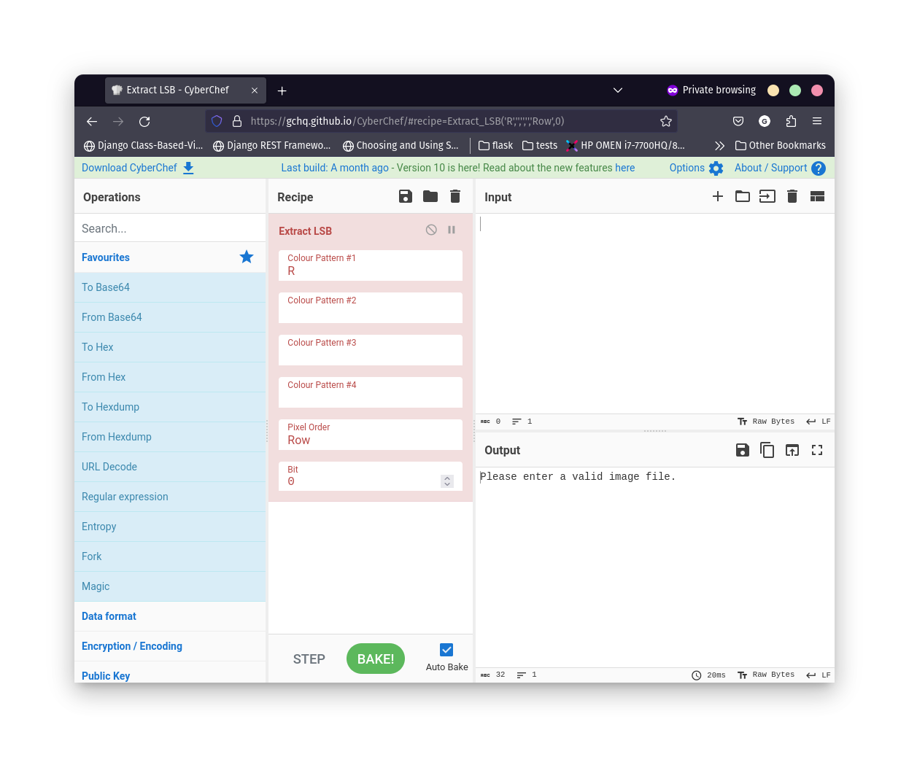
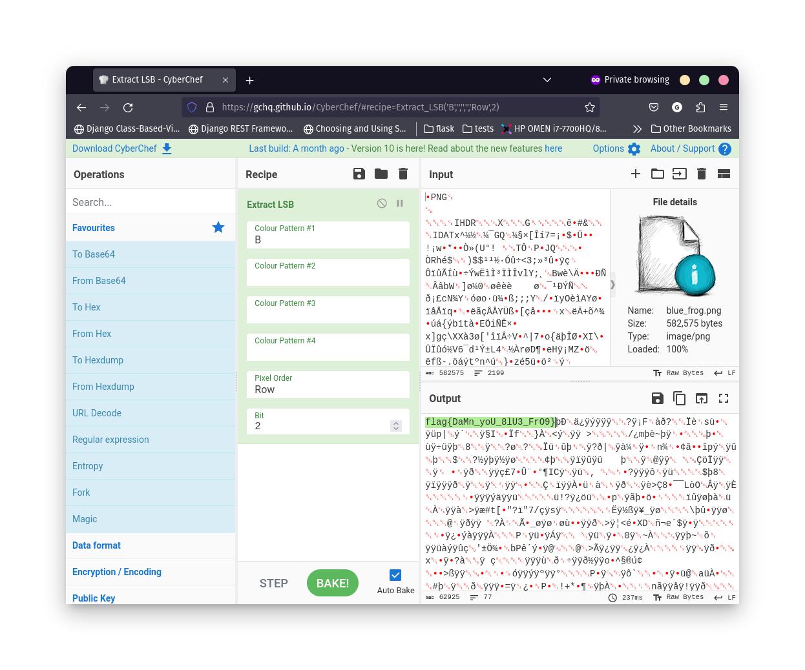

### Discovery

* We are given description:

```It's probably not significant, but my least favourite number is two```

* And `blue_frog.png` file.

### Exploitation

* As we have `png` file we can try various steganography methods.
* Description gives us a hint to use `Least Significant Bit` method.
* Using any tool that has this algorithm, for example. `CyberChef` we see that it has a few parameters.



* Looking at the parameters, description and the image we can assume following parameters: 
    * Colour Pattern: Blue
    * Bit: 2

* Using those parameters and `png` file as an input we get a result:


