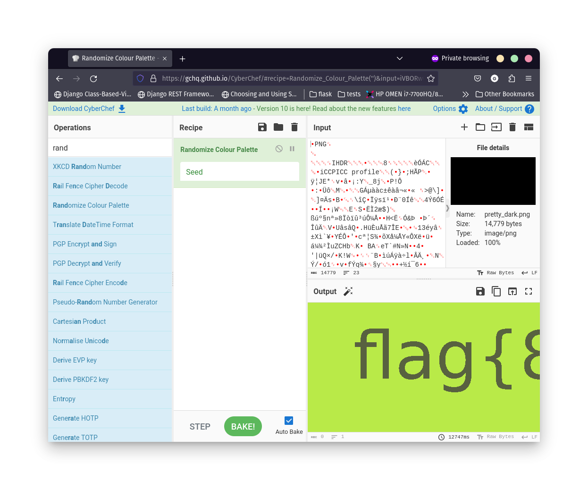

### Discovery

* We are given a `pretty_dark.png` file, which looks entirely black.

### Exploitation

* We can assume that we need to use steganography methods.
* First guess is to randomize the colour palette.
* Using for example `CyberChef` we get a following result:

* Scrolling through the result, the whole flag is visible.